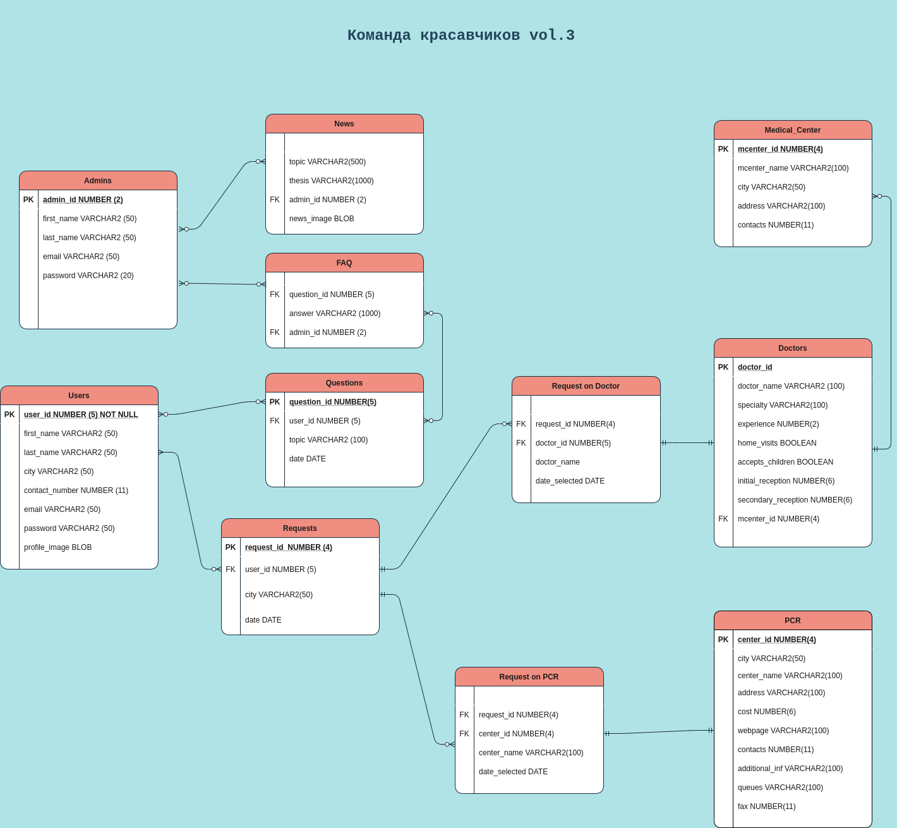

## Collecting the data about medical centers and doctors
### for now, it is only few cities, which are big enough
ECOrona platform is a service for group online sessions for patients with complications after COVID-19, as well as for those patients who transmit the disease asymptomatically. Patients with medium and severe COVID-19 disease often have coughs, shortness of breath with little physical activity, hypo- or atrophy of muscles, functional and psychological problems, disorders of the digestive system and other complications. Online sessions conducted by unique specialists on the ECOrona platform will increase the effectiveness of the recovery period during self-isolation and will also provide access to rehabilitation for patients living in remote areas or who do not have the opportunity to undergo full-time rehabilitation. 

